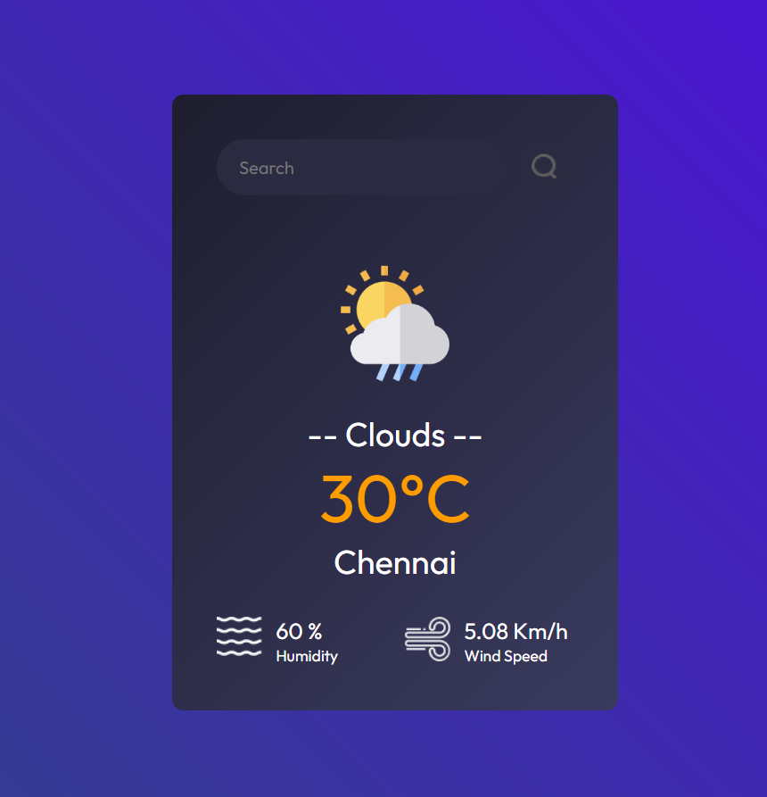

# 🌤️ Weather App React

A simple weather application built with React that displays current weather information for any city using the OpenWeatherMap API.

<div align="center" style="margin: 16px 0;">
  
  <div style="margin-top: 10px; font-size: 0.95rem; color: #555;">
    Weather App – Search and display real-time weather data
  </div>
</div>


## 🚀 Features

- Search for weather by city name
- Displays temperature (°C), humidity, wind speed, and weather condition
- Responsive and modern UI
- Weather icons for different conditions
- Fast development & build using Vite

## 💻 Tech Stack

- **React** (with Hooks)
- **Vite** (for fast development and build)
- **OpenWeatherMap API** (for weather data)
- **CSS** (custom styling, responsive design)
- **ESLint** (code linting)

## Getting Started

1. **📥 Clone the repository:**
   ```sh
   git clone https://github.com/Balaji-R-05/weather-app-react.git
   cd weather-app-react
   ```

2. **🔑 Add your OpenWeatherMap API key**
   - Create a `.env` file in the project root with the following content:
   - VITE_WEATHER_API_KEY (your OpenWeather API key)
   - Get an API key from https://openweathermap.org/ and restart the dev server if it's running.

3. **📦 Install dependencies**
    ```sh
    npm install
    ```

4. **🚀 Run the development server:**
    ```sh
    npm run dev
    ```